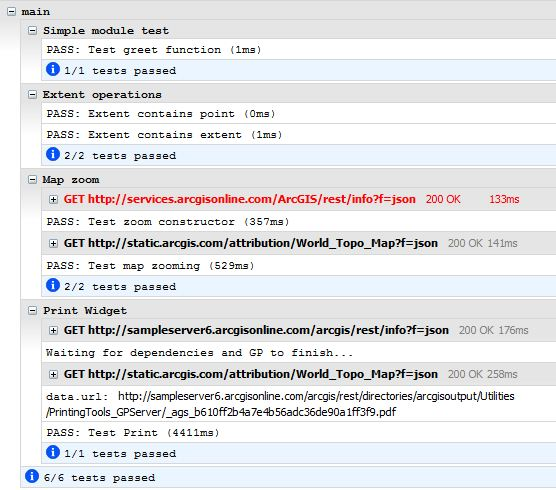

# intern-tutorial-esri-jsapi

This is a tutorial on using intern to unit/functional test your esri JavaScript API apps.

First off big props to Colin Snover over at sitepen for the intern-tutorial found [here](https://github.com/theintern/intern-tutorial). Colins tutorial was my starting point and helped me get the feel for intern and writing the tests themselves. I highly recommend you read his tutorial first, then coming back here.

For a fast start running my example tests, follow these steps:

### Step 1:
* Clone or download this repo.
* We are going to run our tests with a 'head' (browser) so move or copy the tutorial to a web accessible folder. We will be using the browser test runner so intern needs to be server via a web server to avoid any cross domain errors.
* If you don't have node installed, [install](http://nodejs.org/) it.

### Step 2:
* Install intern-geezer in the root of the project:

```bash
cd <path to the tutorial>
npm install intern-geezer
```

* Thats it! your'e done!

### Step 3:
* Lets run the tests I provided in this tutorial, open a browser and point it here:

```bash
http://<path to the tutorial>/intern-tutorial-esri-jsapi/node_modules/intern-geezer/client.html?config=tests/intern
```
* you will need to have your console open as this is where the output from intern tests are displayed when using the browser runner (client.html). It should look something like this:

 

## Important notes:

The key to making intern work with the esri jsapi is two fold:

1. You have to use intern-geezer due to a [bug](https://bugs.dojotoolkit.org/ticket/15616) in dojo 1.8.3 and below. Esri jsapi 3.6 is based on dojo 1.8.3. If your looking to support old IE (8 and below) you need to use intern-geezer anyway.

2. Defining the intern loader to work with the esri jsapi. Intern uses a local copy of dojo core. As such you need to tell it where to find the esri jsapi. Do this in your intern config file:

```javascript
loader: {
        // Packages that should be registered with the loader in each testing environment
    	packages: [{
			name: 'app',
			location: 'app'
		}, {
			name: 'gis',
			location: 'gis'
		}, {
			name: 'esri',
			location: 'http://js.arcgis.com/3.6/js/esri'
		}, {
			name: 'dojo',
			location: 'http://js.arcgis.com/3.6/js/dojo/dojo'
		}, {
			name: 'dojox',
			location: 'http://js.arcgis.com/3.6/js/dojo/dojox'
		}, {
			name: 'dijit',
			location: 'http://js.arcgis.com/3.6/js/dojo/dijit'
		}]
	}
```

You also need to add the locations to your custom modules you want to load and test. In the above example 'app' and 'gis' is where we have some modules/app to test.

## Included tests

1. ```tests\hello.js ``` This test comes from Colins tutorial and is very simple, the hello world of intern.

2. ```tests\extent.js``` This test demonstrates using the esri Extent and Point classes from the api.

3. ```tests\map.js``` This test demonstrates the async testing method. This will be the most common test method as most apps need to wait for objects to load before they can be used. For example ```esri/map```.

4. ```tests\printWidget.js``` This test demonstrates how to use two objects that require waiting until their on load fires before testing. This also shows how to use the async method a little differently than ```map.js``` test. For more info on async tests read [here](https://github.com/theintern/intern/wiki/Writing-Tests#asynchronous-testing).

5. ```tests\functional\index.js``` This test comes from Colins tutorial is is the hello world for functional testing.

## Read the docs
Intern has docs located in the [wiki](https://github.com/theintern/intern/wiki) of the intern repo. Read them. While not comprehensive it does outline everything needed.